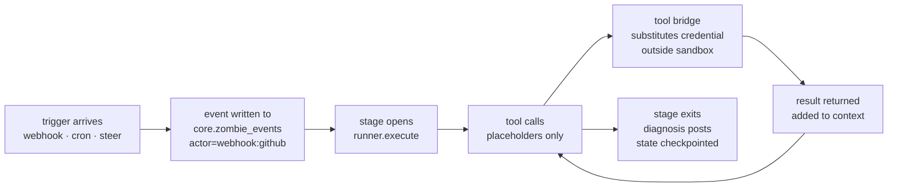

<Tip>
  This page introduces the operator-facing model. For the canonical technical reference — system topology, data flow, billing internals, security boundary, post-ship reflection — read [`docs/architecture/`](https://github.com/usezombie/usezombie/tree/main/docs/architecture) on GitHub.
</Tip>

## The four nouns

UseZombie has four primary objects. Everything else is infrastructure.

<CardGroup cols={2}>
  <Card title="Tenant" icon="building">
    Your top-level billing and identity boundary. Created automatically on first Clerk sign-in. Carries the **credit balance** ($10 starter grant, never expires) and your default Stripe customer.
  </Card>
  <Card title="Workspace" icon="folder-tree">
    A container for zombies and credentials. One tenant can have many workspaces (team, project, environment). Credits are **not** fragmented per workspace — every workspace debits the same tenant wallet.
  </Card>
  <Card title="Zombie" icon="ghost">
    A persistent, durable agent process scoped to one operational outcome. One zombie has one `SKILL.md` + `TRIGGER.md`, a set of triggers (webhook, cron, steer), and a set of workspace credentials it uses but never sees raw bytes for. Lives inside a workspace.
  </Card>
  <Card title="Skill" icon="plug">
    A named tool a zombie's agent can invoke. Tools are declared in `TRIGGER.md` (e.g. `http_request`, `memory_store`, `cron_add`); the runtime injects the credential and executes the call outside the sandbox. Constraint policy — which verbs the agent may use, what it must never do — lives as prose inside `SKILL.md`. No YAML allowlists, no DAG editor.
  </Card>
</CardGroup>

### How they relate

```
Tenant (wallet: $10.00, BYOK: anthropic)
├── Workspace: "platform-ops"
│   ├── Zombie: platform-ops              (zmb_2041)
│   │   └── Tools: http_request, memory_store, cron_add
│   │   └── Triggers: webhook (GitHub Actions), cron, steer
│   └── Credential: github                (workspace-scoped, shared)
└── Workspace: "support"
    └── Zombie: ticket-triage             (zmb_2042)
        └── Tools: http_request, memory_store
        └── Triggers: webhook (Zendesk), steer
```

Every stage debits the same tenant balance regardless of which workspace the zombie lives in. This is the **single-wallet, multi-workspace** model — no per-workspace credit pools, no workspace-scoped top-ups.

## Credits and BYOK

New tenants start with **$10** seeded at signup — never expires.

- **Hosted execution is metered.** UseZombie debits credits on event receipt and per-stage execution. That's what the credit pool pays for.
- **Inference is BYOK.** You attach your own model key (Anthropic, OpenAI, Fireworks, Together, Groq, Moonshot). UseZombie marks up zero. The executor resolves your credential at the tool bridge and your provider bills you directly.
- **Debits happen on completed work only.** A stage that fails before producing output does not debit.

See [Billing and cost control](/billing/plans).

## How a stage runs



A trigger lands on the event stream. A stage opens. The agent calls tools allow-listed by `TRIGGER.md`; each tool result lands in the model's context. The agent never sees raw secret bytes — placeholders substitute at the sandbox boundary. The stage exits when the agent is done or hits a [context boundary](/concepts/context-lifecycle); state checkpoints, the next trigger picks up.

## Core terminology

<AccordionGroup>
  <Accordion title="Zombie">
    A durable runtime instance scoped to one operational outcome. A zombie has a config (`SKILL.md` + `TRIGGER.md`), one or more triggers (webhook, cron, steer), tools it can call, and workspace credentials it uses but never sees raw bytes for. Crashes and worker restarts are transparent — state survives on `core.zombie_events` plus checkpointed memory.
  </Accordion>

  <Accordion title="ZombieConfig (SKILL.md + TRIGGER.md)">
    Two markdown files in `.usezombie/<zombie-name>/`. `SKILL.md` is the system prompt the agent reads — what to investigate, how to phrase a result. `TRIGGER.md` is the YAML frontmatter that declares triggers, allow-listed tools, budget caps, and `x-usezombie.context.*` knobs.

    ```markdown TRIGGER.md
    ---
    name: platform-ops-zombie

    x-usezombie:
      model: "{{model}}"
      context:
        context_cap_tokens: 200000
        tool_window: auto
        memory_checkpoint_every: 5
        stage_chunk_threshold: 0.75

      trigger:
        type: webhook
        source: github
        signature:
          secret_ref: github_secret
          header: x-hub-signature-256
          prefix: "sha256="

      tools:
        - http_request
        - memory_recall
        - memory_store
        - cron_add
        - cron_list
        - cron_remove

      credentials:
        - github
        - slack
    ---
    ```

    ```markdown SKILL.md
    You are the platform-ops zombie. When a deploy fails on production,
    gather evidence from Fly, Upstash, and the failed GitHub workflow. Post an
    evidenced diagnosis to #platform-ops. Read-only outside the Slack post.
    ```

    See [Authoring skills](/zombies/skills) for the full `TRIGGER.md` reference.
  </Accordion>

  <Accordion title="Trigger">
    A zombie has **one** declared trigger in `TRIGGER.md` — the entry-point that turns external signal into an event. Today that's a `webhook`: an external system (GitHub Actions, Zendesk, custom) POSTs to `https://api.usezombie.com/v1/webhooks/{zombie_id}` signed against a workspace credential.

    Beyond the declared trigger, two more sources can land work on the same event stream and feed the same reasoning loop:

    - **Cron firings** — the zombie schedules its own future events via the `cron_add` tool. The runtime fires them on schedule with `actor=cron:<schedule>`.
    - **Steer messages** — a human posts via `zombiectl steer <zombie_id> "..."` (or the messages API). Events land with `actor=steer:<user>`.

    Each event on `core.zombie_events` carries actor provenance — `webhook:github`, `cron:<schedule>`, `steer:<user>`, `continuation:<original_actor>`. The zombie doesn't branch on actor type; `SKILL.md` decides what to do based on the event payload.
  </Accordion>

  <Accordion title="Tool">
    A named verb the agent can invoke. Declared in `TRIGGER.md`. Examples:
    - `http_request` — make an outbound HTTP call. Domains restricted by SKILL prose.
    - `memory_store` / `memory_recall` / `memory_list` / `memory_forget` — durable cross-event learning. See [`/memory`](/memory) for the API + four categories.
    - `cron_add` / `cron_list` / `cron_remove` — schedule future stage triggers.
    - Slack posts, GitHub calls, hosting-provider queries — all happen via `http_request` against the relevant credential.

    Constraint policy (e.g. "read-only against GitHub, Fly, and Upstash; the only write path is the Slack post") lives as prose in `SKILL.md`. The prose is the contract today; structural enforcement comes when a second zombie reuses the same policy.
  </Accordion>

  <Accordion title="Tool bridge (credential firewall)">
    The boundary between your secrets and the model. Credentials are stored encrypted at the workspace level. When the agent invokes a tool, the bridge intercepts: it substitutes the placeholder for the real secret, makes the outbound call, and returns the response. The model process sees only placeholders — never raw API keys, never tokens.

    Prompt-injection attacks that try to exfiltrate the credential succeed only at recovering the placeholder.
  </Accordion>

  <Accordion title="Event stream (core.zombie_events)">
    The append-only ledger. Every webhook receipt, cron fire, steer message, tool call, and stage exit lands on `core.zombie_events` with actor provenance and a monotonic sequence number. Replay via `zombiectl events <zombie_id>`. Tail live via SSE at `/v1/workspaces/{wid}/zombies/{zid}/events/stream`. The same stream powers Mission Control's activity timeline.
  </Accordion>

  <Accordion title="Memory checkpoint">
    A durable snapshot the agent writes during a long stage by calling `memory_store`. The runtime emits a `memory_checkpoint_due` signal every N tool calls (`memory_checkpoint_every`, default 5) and the agent's `SKILL.md` prose decides what to record. The runtime never auto-snapshots — see [context lifecycle](/concepts/context-lifecycle) for who actually enforces what.
  </Accordion>

  <Accordion title="Stage chunking">
    The failsafe for when the agent's prompt is approaching the model's context cap. The agent voluntarily ends the stage with `exit_ok: false` + a `checkpoint_id`; the worker re-enqueues the same event chain as a synthetic continuation event with `actor=continuation:<original_actor>` (`src/zombie/continuation.zig`). The next stage starts on a fresh prompt; `SKILL.md` prose tells the agent to call `memory_recall` to pick up state.

    Each chain caps at **10 continuations** — past that the worker stops re-enqueueing and labels the originating row `chunk_chain_escalate_human`. See [context lifecycle](/concepts/context-lifecycle).
  </Accordion>

  <Accordion title="Session state (resume-on-crash)">
    `core.zombie_sessions.context_json` is a thin per-zombie row that carries `{last_event_id, last_response}` (response truncated to 2 KB) so the worker can pick up after a crash without losing its place. It is **not** the conversation history — that lives in the LLM message buffer for the duration of one stage and on `core.zombie_events` durably; cross-event learning lives in [`/memory`](/memory). Wiring at `src/zombie/event_loop_helpers.zig:69-89`.
  </Accordion>

  <Accordion title="Approval gate">
    Some tools require human approval before the agent can call them — declared per-tool in `TRIGGER.md`. The runtime pauses the stage, posts an approval request to Slack and Mission Control, and resumes only on explicit Approve. State machine survives worker restarts; nothing in flight is lost.
  </Accordion>

  <Accordion title="Kill switch">
    `zombiectl kill <zombie_id>` stops the running stage immediately. State is checkpointed to the last memory write — nothing on the event stream is lost. Resume with `zombiectl steer` once you've fixed the underlying issue.
  </Accordion>

  <Accordion title="Budget">
    Dollar ceilings on hosted execution declared in `TRIGGER.md`. `daily_dollars` caps spend over a rolling 24-hour window; `monthly_dollars` caps the calendar month. Hitting either ceiling stops new stages from opening; in-flight stages drain. Inference cost is BYOK and not subject to UseZombie's budget — your provider's caps apply there.
  </Accordion>
</AccordionGroup>
