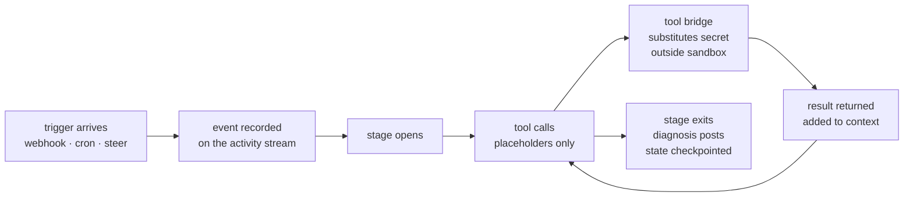

<Tip>
  This page introduces the operator-facing model. For the canonical technical reference — system topology, data flow, billing internals, security boundary, post-ship reflection — read [`docs/architecture/`](https://github.com/usezombie/usezombie/tree/main/docs/architecture) on GitHub.
</Tip>

## The four nouns

usezombie has four primary objects. Everything else is infrastructure.

<CardGroup cols={2}>
  <Card title="Tenant" icon="building">
    Your top-level billing and identity boundary. Created automatically on first Clerk sign-in. Carries the **credit balance** ($5 starter grant, never expires) and your default Stripe customer.
  </Card>
  <Card title="Workspace" icon="folder-tree">
    A container for zombies and credentials. One tenant can have many workspaces (team, project, environment). Credits are **not** fragmented per workspace — every workspace debits the same tenant wallet.
  </Card>
  <Card title="Zombie" icon="ghost">
    A persistent, durable agent process scoped to one operational outcome. One zombie has one `SKILL.md` + `TRIGGER.md`, a set of triggers (webhook, cron, steer), and a set of workspace credentials it uses but never sees raw bytes for. Lives inside a workspace.
  </Card>
  <Card title="Skill" icon="plug">
    A named tool a zombie's agent can invoke. Tools are declared in `TRIGGER.md` (e.g. `http_request`, `memory_store`, `cron_add`); the runtime injects the credential and executes the call outside the sandbox. Constraint policy — which verbs the agent may use, what it must never do — lives as prose inside `SKILL.md`. No YAML allowlists, no DAG editor.
  </Card>
</CardGroup>

### How they relate

```
Tenant  (wallet: $5.00, BYOK: anthropic)
│
├── Workspace: "platform-ops"
│   │
│   ├── Zombie: platform-ops      (zmb_2041)
│   │   ├── Tools:    http_request, memory_store, cron_add
│   │   └── Triggers: webhook (GitHub Actions), cron, steer
│   │
│   └── Credential: github        (workspace-scoped, shared)
│
└── Workspace: "support"
    │
    └── Zombie: ticket-triage     (zmb_2042)
        ├── Tools:    http_request, memory_store
        └── Triggers: webhook (Zendesk), steer
```

Every stage debits the same tenant balance regardless of which workspace the zombie lives in. This is the **single-wallet, multi-workspace** model — no per-workspace credit pools, no workspace-scoped top-ups.

## Credits and BYOK

New tenants start with **$5** seeded at signup — never expires.

- **Hosted execution is metered.** usezombie debits credits on event receipt and per-stage execution. That's what the credit pool pays for.
- **Inference is BYOK.** You attach your own model key (Anthropic, OpenAI, Fireworks, Together, Groq, Moonshot). usezombie marks up zero. The executor resolves your credential at the tool bridge and your provider bills you directly.
- **Debits happen on completed work only.** A stage that fails before producing output does not debit.

See [Billing and cost control](/billing/plans).

## How a stage runs



A trigger lands on the event stream. A stage opens. The agent calls tools allow-listed by `TRIGGER.md`; each tool result lands in the model's context. The agent never sees raw secret bytes — placeholders substitute at the sandbox boundary. The stage exits when the agent is done or hits a [context boundary](/concepts/context-lifecycle); state checkpoints, the next trigger picks up.

## Core terminology

<AccordionGroup>
  <Accordion title="Zombie">
    A persistent, always-on agent scoped to one operational outcome. A zombie has two markdown files (`SKILL.md` + `TRIGGER.md`), a trigger that wakes it, a list of tools it can call, and the workspace credentials it needs. Crashes and restarts are transparent — the platform survives them.
  </Accordion>

  <Accordion title="Stage">
    One end-to-end execution of the agent on one trigger: webhook arrives → agent reasons → tool calls → result. Most zombies finish a stage in a few seconds. See [How long does a stage take?](/concepts/context-lifecycle).
  </Accordion>

  <Accordion title="Trigger">
    What wakes a zombie. Three sources, all feeding the same reasoning loop:

    - **Webhook** — an external system (GitHub, Slack, your monitoring) POSTs to `https://api.usezombie.com/v1/webhooks/{zombie_id}`.
    - **Cron** — the zombie schedules its own future stages via the `cron_add` tool.
    - **Steer** — a human invokes `zombiectl steer <zombie_id> "..."` for a manual stage.

    `SKILL.md` decides what to do based on the event payload.
  </Accordion>

  <Accordion title="Tool">
    A named verb the agent can invoke, declared in `TRIGGER.md`:
    - `http_request` — outbound HTTP. Slack posts, GitHub calls, your provider — all go through this.
    - `memory_store` / `memory_recall` / `memory_list` / `memory_forget` — durable cross-event learning. See [Memory](/memory).
    - `cron_add` / `cron_list` / `cron_remove` — schedule future stages.

    The agent can only call tools that are explicitly listed. A jailbroken agent cannot reach outside the list.
  </Accordion>

  <Accordion title="Tool bridge">
    The boundary between your secrets and the model. Credentials are stored encrypted in the workspace vault; the model itself only sees `${secrets.NAME.FIELD}` placeholders. When the agent invokes a tool, the **tool bridge** substitutes the real secret value outside the sandbox, makes the outbound call, and returns the response — never the secret. A prompt-injection attack recovers only the placeholder string. See [Workspace credentials](/zombies/credentials).
  </Accordion>

  <Accordion title="Budget">
    Dollar ceilings on hosted execution (the platform compute that runs your zombie — separate from your model provider's bill) declared in `TRIGGER.md`. `daily_dollars` caps spend over a rolling 24-hour window; `monthly_dollars` caps the calendar month. Hitting either ceiling stops new stages from opening. Inference cost is BYOK — your provider's own caps apply there.
  </Accordion>
</AccordionGroup>
