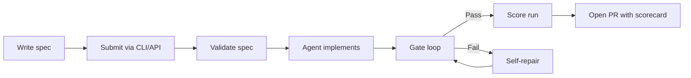
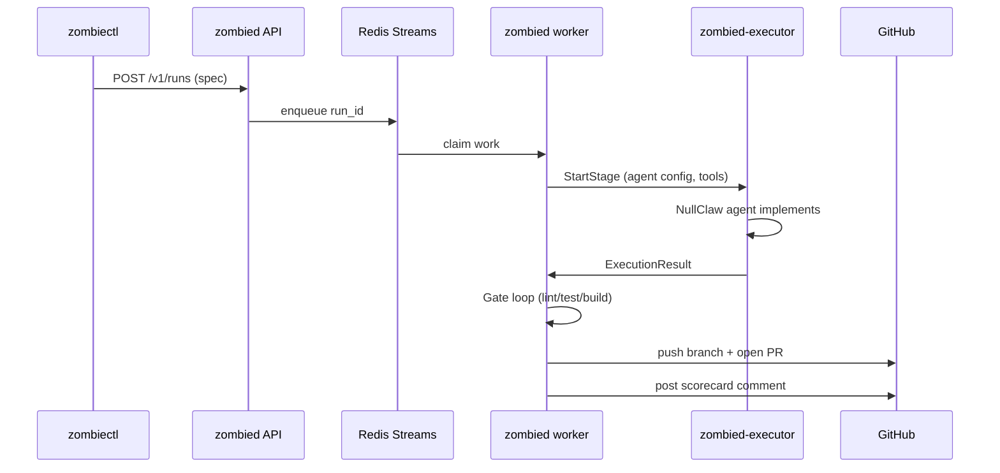

## The spec-to-PR lifecycle

UseZombie turns a markdown spec into a validated pull request through a deterministic pipeline: validate, implement, gate, score, ship.

## Step by step

<Steps>
  <Step title="Write a spec">
    A spec is a markdown file describing what you want built. It can follow any format — structured sections, free-form prose, bullet lists. The agent reads natural language and infers intent from your codebase context.

    You describe **what** to build. The agent figures out **how**.
  </Step>

  <Step title="Submit">
    Submit via `zombiectl run --spec <path>` or the REST API (`POST /v1/runs`). On submission, UseZombie validates that referenced files exist in the workspace, deduplicates against in-flight runs, and enqueues the work.
  </Step>

  <Step title="Agent implements">
    The NullClaw agent runtime picks up the run and works inside an **isolated git worktree** — a fresh working directory branched from your default branch. The agent receives the spec plus injected codebase context (relevant file contents, module structure) to produce an accurate implementation.

    No changes touch your main branch until you approve the PR.
  </Step>

  <Step title="Gate loop">
    After implementation, the agent runs your project's standard validation gates in sequence:

    1. `make lint` — linting and type checks
    2. `make test` — unit tests
    3. `make build` — production build

    If any gate fails, the agent reads the error output, diagnoses the issue, and self-repairs. This loop runs up to **3 times** by default. If all repair attempts fail, the run is marked `FAILED` with full error context.

    <Info>
      The repair limit is configurable per agent profile. See [Gate loop](/runs/gate-loop) for details.
    </Info>
  </Step>

  <Step title="Score">
    Every completed run receives a **scorecard** with four weighted dimensions:

    | Dimension | Weight | What it measures |
    |-----------|--------|------------------|
    | Completion | 40% | Did the agent implement everything the spec asked for? |
    | Error rate | 30% | How many gate failures occurred before passing? |
    | Latency | 20% | Wall-clock time from enqueue to PR. |
    | Resource efficiency | 10% | Token and compute usage relative to task complexity. |

    Scores map to tiers:

    | Tier | Score range |
    |------|-------------|
    | Bronze | 0 -- 39 |
    | Silver | 40 -- 69 |
    | Gold | 70 -- 89 |
    | Elite | 90 -- 100 |
  </Step>

  <Step title="PR">
    The agent pushes a branch named `zombie/<run_id>/<slug>` and opens a pull request on GitHub. The PR body contains an agent-generated explanation of what was implemented and why. A scorecard comment is posted with the quality metrics.

    From here, it's a normal code review. Approve, request changes, or close.
  </Step>
</Steps>

## Runtime architecture

Under the hood, the CLI, API server, queue, worker, and executor coordinate to move a run from submission to PR.

**Component responsibilities:**

- **zombiectl** — CLI client. Submits specs, checks status, streams logs.
- **zombied API** — HTTP server. Validates specs, manages runs and workspaces, serves the dashboard.
- **Redis Streams** — Work queue. Durable, ordered, with consumer group semantics for worker fleet scaling.
- **zombied worker** — Claim runs, orchestrate the gate loop, push results to GitHub. Supports drain and rolling deploys.
- **zombied-executor** — Sidecar process that owns the sandbox lifecycle. Spawns NullClaw agents, manages worktrees, enforces resource limits.
- **GitHub** — Target forge. Branch push, PR creation, scorecard comments.
