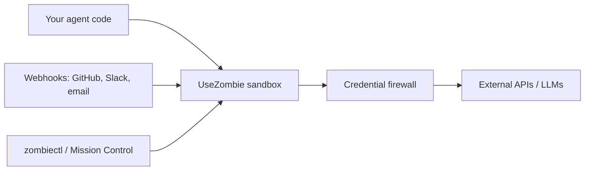
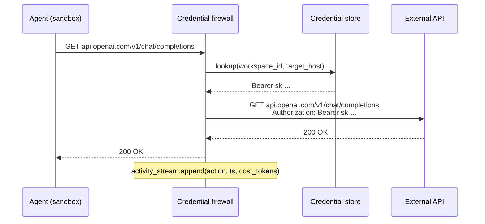
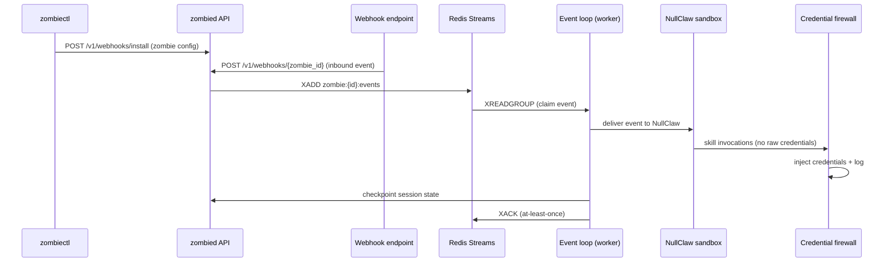

## The agent hosting model

UseZombie sits between your agent and the outside world. You bring the agent logic. We provide the runtime: a sandboxed process, a credential firewall, wired webhooks, and a kill switch.

Your agent never sees raw credentials. It makes requests. The firewall intercepts them, injects the right token, and forwards. The activity stream records every action.

## Step by step

<Steps>
  <Step title="Install a zombie">
    Run `zombiectl install <template>` to create a zombie config file. Edit it to set your trigger, skills, and agent instructions. Run `zombiectl up` to deploy. UseZombie provisions a webhook endpoint, starts the event loop, and your agent is live in seconds.
  </Step>

  <Step title="Store credentials — once">
    Add API keys and tokens via `zombiectl credential add` or Mission Control. Credentials are encrypted at rest and never passed into the sandbox. Your agent invokes a skill by name; the firewall handles the rest.
  </Step>

  <Step title="Firewall injects credentials per-request">
    When your agent makes an outbound request, the firewall intercepts it, matches the target against your credential policy, and injects the token before forwarding. The agent code never contains a key — it just makes requests.

    <Info>
      This is the core security guarantee: credential injection happens at the network boundary, outside the sandbox. A compromised agent cannot exfiltrate credentials it never received.
    </Info>
  </Step>

  <Step title="Webhooks arrive without ngrok">
    Every zombie gets a stable, unique webhook URL at `https://hooks.usezombie.com/v1/webhooks/{zombie_id}`. Point GitHub, Slack, email, or any HTTP source at it. Events are authenticated with a Bearer token and queued to the zombie's inbox. No tunneling, no port forwarding, no custom servers.
  </Step>

  <Step title="Observe and control">
    Every agent action is timestamped in the activity stream: what ran, when, what it called, and what it cost. Budget alerts fire before you hit limits. The kill switch stops any agent mid-action from the CLI or dashboard.
  </Step>
</Steps>

## Credential firewall architecture

The agent makes a plain HTTP request. The firewall resolves the right credential from the store, injects it, and forwards. The agent receives the response. The credential value never crosses the sandbox boundary.

## Runtime architecture

**Component responsibilities:**

- **`zombiectl`** — CLI client. Installs zombies, manages credentials, checks status, streams logs.
- **`zombied` API** — HTTP server. Manages zombie lifecycle, webhook ingestion, credential store, billing.
- **Redis Streams** — Per-zombie event inbox. Durable, ordered, consumer group semantics for at-least-once delivery.
- **Event loop** — Worker thread that drives a zombie. Claims events, delivers to sandbox, checkpoints state, acks queue.
- **NullClaw** — The embedded agent runtime inside the sandbox. Receives events and instructions, produces skill invocations and responses.
- **Credential firewall** — Network-layer proxy. Intercepts outbound skill requests, injects credentials, records to the activity stream.

## Spend control

Every workspace has configurable limits that prevent runaway costs:

| Control | What it does |
|---------|-------------|
| Token budget | Max tokens per agent execution window |
| Wall time limit | Max wall-clock time before forced stop |
| Cost ceiling | Max USD spend per billing period |
| Kill switch | Manual stop from CLI or Mission Control at any time |

When a limit is hit, the agent receives a graceful shutdown signal. The activity stream records the reason. No surprises on the invoice.
