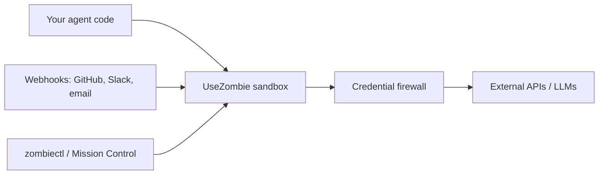
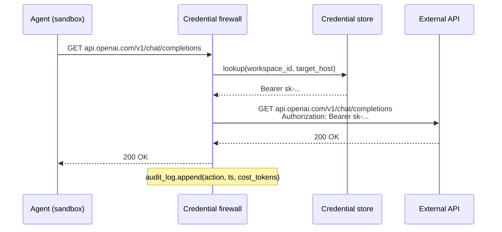
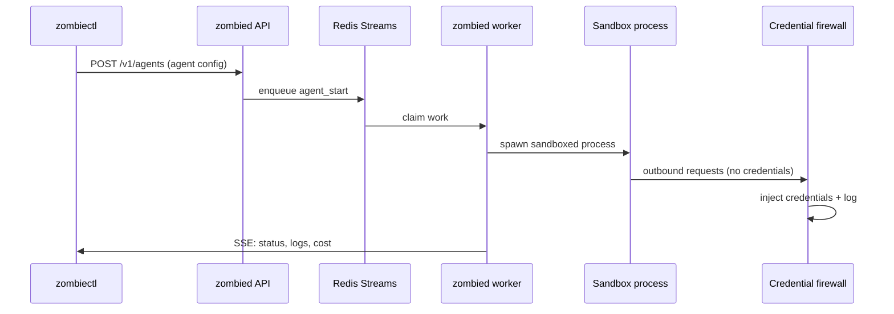

## The agent hosting model

UseZombie sits between your agent and the outside world. You bring the agent logic. We provide the runtime: a sandboxed process, a credential firewall, wired webhooks, and a kill switch.

Your agent never sees raw credentials. It makes requests. The firewall intercepts them, injects the right token, and forwards. Audit logs record every action.

## Step by step

<Steps>
  <Step title="Connect your agent">
    Push your agent code to a workspace. UseZombie wraps it in a sandboxed process with resource limits (CPU, memory, wall time). The agent starts running immediately and restarts automatically on crash.
  </Step>

  <Step title="Store credentials — once">
    Add API keys, tokens, and secrets to the workspace credential store via `zombiectl skill-secret put` or Mission Control. Credentials are encrypted at rest and never passed into the sandbox.
  </Step>

  <Step title="Firewall injects credentials per-request">
    When your agent makes an outbound request, the firewall intercepts it, matches the target against your credential policy, and injects the token before forwarding. The agent code never contains a key — it just makes requests.

    <Info>
      This is the core security guarantee: credential injection happens at the network boundary, outside the sandbox. A compromised agent cannot exfiltrate credentials it never received.
    </Info>
  </Step>

  <Step title="Webhooks arrive without ngrok">
    Register webhook sources (GitHub, Slack, email, custom HTTP) on the workspace. UseZombie provides a stable inbound endpoint and routes matching events to your agent process. No tunneling, no port forwarding, no custom servers.
  </Step>

  <Step title="Observe and control">
    Every agent action is timestamped in the audit log: what ran, when, what it called, and what it cost. Budget alerts fire before you hit limits. The kill switch stops any agent mid-action from the CLI or dashboard.
  </Step>
</Steps>

## Credential firewall architecture

The agent makes a plain HTTP request. The firewall resolves the right credential from the store, injects it, and forwards. The agent receives the response. The credential value never crosses the sandbox boundary.

## Runtime architecture

**Component responsibilities:**

- **`zombiectl`** — CLI client. Deploys agents, checks status, manages secrets, streams logs.
- **`zombied` API** — HTTP server. Manages agent lifecycle, credential store, webhook routing, billing.
- **Redis Streams** — Work queue. Durable, ordered, with consumer group semantics for worker fleet scaling.
- **`zombied` worker** — Owns the sandbox lifecycle. Spawns agents, enforces resource limits, handles restarts.
- **Credential firewall** — Network-layer proxy. Intercepts outbound requests, injects credentials, records audit logs.

## Spend control

Every workspace has configurable limits that prevent runaway costs:

| Control | What it does |
|---------|-------------|
| Token budget | Max tokens per agent execution window |
| Wall time limit | Max wall-clock time before forced stop |
| Cost ceiling | Max USD spend per billing period |
| Kill switch | Manual stop from CLI or Mission Control at any time |

When a limit is hit, the agent receives a graceful shutdown signal. The audit log records the reason. No surprises on the invoice.
