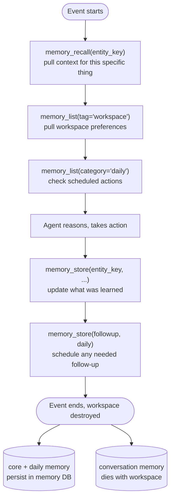
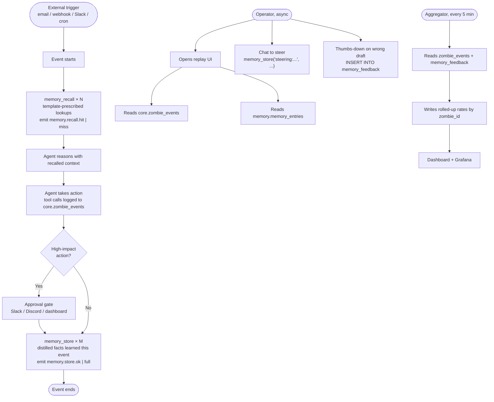

**Applies to:** Customer Support zombies and any custom zombie.
**Default state:** Memory is *enabled by default* for zombies on current usezombie releases. Older zombies opt in with `zombiectl zombie memory enable`.

---

## What memory is, in one sentence

Memory is what a zombie *learned* from prior events that lets it behave like a teammate who's been here before, instead of a goldfish that showed up this morning.

---

## The problem memory solves (the flat tyre nobody calls a flat tyre)

A flat tyre is usually acute and visible. Memoryless zombies don't feel flat-tyred because the pain shows up as three slow leaks:

1. **Death by re-steering.** You correct the zombie on Monday. You correct it again Wednesday. And Friday. Each correction feels minor — cumulatively it's a huge tax. No single moment looks like failure.
2. **Confident wrongness with delayed blowback.** "Following up on our last call…" when no call happened. Damage shows up days later as a churned customer, an ignored ticket, a wrong-plan assertion. The cause looks like "AI wasn't good enough" — it's actually "AI had no memory of what actually happened."
3. **Silent redundancy.** Re-asking a customer for information they already gave. Re-classifying the same issue. Small per-instance, large in aggregate, invisible to an operator not watching closely.

**Reframed:** the zombie feels *almost* useful — enough to keep, not enough to trust. The operator becomes its permanent supervisor. Memory is what converts "needs re-briefing every event" into "remembers the briefing." That's the flat tyre. It hides because it's the difference between "no AI" and "underwhelming AI," not "no AI" and "no car."

The **observability layer on top of memory** (see Metrics section) exists for a second-order flat tyre: once memory ships, you can't tell if it's working. Recall could be silently missing. Steering could be stored but not applied. Without metrics, memory is a black box.

---

## Log vs memory (the distinction that makes or breaks the feature)

**Log** = what happened. Tool calls, events, timestamps. Raw history. UseZombie already has this via SSE streams and the events history endpoint.

**Memory** = what the zombie *learned* from what happened. Curated, distilled, judged. The agent decides "this fact is worth keeping, that one isn't."

| | Log | Memory |
|---|---|---|
| Answers | "What did the zombie do yesterday?" | "What does the zombie now know that it didn't know before?" |
| Granularity | Every tool call, every event | One entry per durable fact |
| Who writes it | The system | The agent (via `memory_store`) |
| Example | `POST /v1/execute {slack.com/...} → 200` | `"Bob at Acme prefers technical responses, on Pro plan since Jan"` |

If a zombie's memory looks like a log, the skill template is wrong. Fix the template, not the storage.

---

## The 4 memory categories

```
┌──────────────────┬───────────────┬────────────────────────────┬──────────────────────────────┐
│     Category     │     Scope     │         Durability         │             Use              │
├──────────────────┼───────────────┼────────────────────────────┼──────────────────────────────┤
│ core             │ zombie        │ permanent until forgotten  │ learned entities, preferences│
├──────────────────┼───────────────┼────────────────────────────┼──────────────────────────────┤
│ daily            │ zombie        │ 72h auto-prune             │ follow-ups, open tickets     │
├──────────────────┼───────────────┼────────────────────────────┼──────────────────────────────┤
│ conversation     │ event         │ dies with workspace        │ within-event working notes   │
├──────────────────┼───────────────┼────────────────────────────┼──────────────────────────────┤
│ workspace        │ workspace     │ durable (separate system)  │ shared facts across zombies  │
└──────────────────┴───────────────┴────────────────────────────┴──────────────────────────────┘
```

- `core` and `daily` land in the dedicated memory database. **These are what survive workspace destruction.**
- `conversation` stays in workspace SQLite — fast, local, discarded.
- `workspace` is a separate system — out of scope for this doc.

---

## Primitives (what the zombie actually calls)

The zombie uses four tool calls. The harness wires them to the right backend automatically.

| Tool | Shape | Used for |
|---|---|---|
| `memory_store(key, category, content, tags?)` | upsert | write a distilled fact |
| `memory_recall(key)` | returns one entry or empty | exact lookup by key |
| `memory_list(filter)` | returns matching entries | filter by category/tags/recency |
| `memory_forget(key)` | delete | correct or remove a fact |

No vector search, no embeddings. Pre-filter with tags/categories/recency, then let the LLM reason over the candidate set. Modern context windows + LLM judgment beat cosine similarity for typical zombie memory sizes.

---

## Memory entry format (the human-readable view)

Memory is stored in a dedicated Postgres database but exported as markdown for human review and editing. Each entry round-trips through this format:

```markdown
---
key: customer_bob_chen_acme
category: core
zombie_id: zom_support_01
tags: [customer, plan_pro, api_user]
created: 2026-04-10T14:22:11Z
updated: 2026-04-12T09:01:03Z
---

Bob Chen, Acme (acme.com) — bob@acme.com.
Plan: Pro since Jan 15. API user (not dashboard), webhooks → Slack.
Preferences: technical responses, terse.
Prior issues: Feb 3 signature issue (NTP), Mar 22 rate limit (upgraded).
Flag acme_webhook_retry_v2 enabled.
```

Frontmatter is structured metadata. The body is free-form distilled prose the agent wrote.

---

## Runtime flow (generic — same for every zombie)



The two memory touchpoints are at the **start** (recall, before deciding) and the **end** (store, after deciding). Anything in the middle writing to memory is probably a bug — that's scratch that belongs in `conversation`.

---

## Setup — memory-specific steps for any zombie

Memory is default-on for new zombies. Explicit configuration looks like:

```bash
# Enable memory (no-op if already enabled)
zombiectl zombie memory enable --zombie {zombie_id} \
  --categories core,daily \
  --daily-retention-hours 72

# Verify
zombiectl zombie memory status --zombie {zombie_id}
# Backend: postgres (memory.memory_entries)
# Categories: core, daily
# Entries: N
# Retention (daily): 72h
```

Seeding memory before the first event is optional but dramatically improves day-1 behavior for zombies with known priors (customer base, account flags). Use `zombiectl memory import` with a local folder of markdown entries.

---

## Edit-then-replay — correcting what the zombie learned

Memory lives in Postgres, but humans interact with it as markdown on their laptop.

```bash
# Export to the operator's machine (never touches worker filesystems)
zombiectl memory export --zombie {zombie_id} --out ./zombie-memory/

# Review / fix / delete entries
vim ./zombie-memory/core/some_entity.md
rm ./zombie-memory/core/stale_entry.md

# Import — the next event sees the corrections
zombiectl memory import --zombie {zombie_id} --from ./zombie-memory/

# Optional: treat the exported folder as a git repo for audit history
cd ./zombie-memory && git init && git add . && git commit -m "Correct Acme plan"
```

This composes with two primitives UseZombie already shipped:

| Primitive | When | What it does |
|---|---|---|
| Event replay | after an event | forensic event playback |
| Interrupt and steer | during an event | live correction |
| Memory export/import | between events | surgical brain-edit |

---

## Metrics — is memory actually helping?

| Metric | Meaning | Healthy zone |
|---|---|---|
| Recall-hit rate | fraction of events where `memory_recall` returned context | rises from 0% → 30-60% at steady state |
| Duplicate-action rate | zombie took an action it already took in a prior event | < 2-5% |
| Wrong-context-asserted | zombie confidently stated something false from memory | MUST stay near zero — P0 trust metric |
| Memory size per zombie | total entries × avg size | monitor for runaway growth |
| Daily-followup compliance | daily reminders acted on in-window | > 80% at steady state |

If recall-hit rate stays near zero after a week of operation, the skill template isn't storing the right things or isn't recalling at the right moment. That's a policy problem, not a storage problem.

---

## End-to-end flow



Two surfaces the operator looks at, and they're different tables:

| Surface | Table | Purpose |
|---|---|---|
| "What did the zombie do?" | `core.zombie_events` | Append-only timeline of every tool call and event |
| "What does the zombie know?" | `memory.memory_entries` | Curated durable facts — editable, exportable |

Steering happens two ways and they're complementary, not alternatives:

- **In-app replay chat** → coach the zombie live. Chat messages get stored as `steering:*` entries and persist for future events.
- **Slack / Discord / dashboard approval** → gate specific high-impact actions (page on-call, send offer, auto-scale). Not a steering surface — a go/no-go surface.

---

## Customer Support zombie — what to remember

| | |
|---|---|
| Key convention | `customer_{name_slug}_{company_slug}`, `account_{company_slug}`, `customer_flags_{...}`, `ticket_open_{id}` |
| Core stores | customer profile, account context, feature flags, prior issues |
| Core seeds | optional bulk import from CRM on enable |
| Daily stores | open tickets (with auto-prune once resolved) |
| Forgets | full ticket transcripts (ticketing system has them), unneeded PII |
| Recall-critical moment | every customer message — full context before drafting |
| Win metric | re-question rate < 3%, wrong-context-asserted near zero |
| Edit-then-replay hotspot | plan upgrades, contact changes, preference shifts |

Example entry:
```
---
key: customer_bob_chen_acme
category: core
tags: [customer, plan_pro, api_user]
---
Bob Chen, Acme. Pro since Jan 15. API user (not dashboard), webhooks → Slack.
Prefers technical responses. Prior: Feb 3 signature issue (NTP), Mar 22 rate limit (upgraded).
Flag acme_webhook_retry_v2 enabled.
```

---

## Custom zombies

Any custom zombie follows the same pattern:

1. **Pick a key convention** — stable, deterministic from the input. `{entity_type}_{identifier}`.
2. **Define what's worth a `core` entry** — learned facts about durable entities, not transcripts.
3. **Define what's `daily`** — anything time-bounded, with a natural expiry.
4. **Seed any priors** — workspace preferences, role definitions, known patterns.
5. **Wire `memory_recall` to the start of the flow** — before deciding, not after.
6. **Wire `memory_store` to the end of the flow** — after deciding what was learned.

The skill template encodes these choices.

---

## Isolation and security

**Row-level zombie_id scoping.** Every memory operation includes `WHERE zombie_id = $current`. Zombie A cannot read Zombie B's memory via the memory tool.

**Process boundary.** Memory lives in Postgres, not on a shared filesystem. If a zombie has shell or file tools, those cannot reach memory — wrong protocol, wrong credentials. Cross-tenant data that a sandboxed agent must not read cannot share a filesystem with the agent.

**PII discipline.** Customer Support is the highest-sensitivity case. Configure redaction in the skill template; run `zombiectl memory scrub` to retroactively remove matched patterns.

---

## Troubleshooting

| Symptom | Cause | Fix |
|---|---|---|
| Zombie "forgets" between events | Memory not enabled for this zombie | `zombiectl zombie memory enable` |
| Recall returns nothing on known entity | Key convention inconsistent | Audit skill template; stable key derivation |
| Memory grows forever | No pruning on `core` (by design) | Use `zombiectl memory forget` or export→prune→import |
| Responses feel generic despite memory | Template not recalling before drafting | Audit: `memory_recall` MUST happen before the reasoning step |
| `UZ-MEM-001` on store | Memory backend unreachable | Check `zombie memory status`; verify DB connection |
| Sibling zombie's memory visible | Must never happen — P0 | Stop shipping; isolation broken |
| Wrong-context asserted to user | Stale memory, underlying system changed | Export → correct → import; add a sync job from system-of-record |
| Daily entry expired before resolved | 72h TTL hit, issue is long-running | Promote to `core` with `tag: open_extended` |

---

## External agent variant

Any external pipeline (LangGraph, CrewAI, custom Python) can use UseZombie memory
by calling the memory API directly:

```bash
curl -X POST https://api.usezombie.com/v1/memory/recall \
  -H "Authorization: Bearer <YOUR_ZMB_KEY>" \
  -d '{"zombie_id": "zom_xyz", "key": "customer_bob_chen_acme"}'

curl -X POST https://api.usezombie.com/v1/memory/store \
  -H "Authorization: Bearer <YOUR_ZMB_KEY>" \
  -d '{
    "zombie_id": "zom_xyz",
    "key": "customer_bob_chen_acme",
    "category": "core",
    "tags": ["customer", "plan_pro"],
    "content": "Bob Chen, Acme. Pro since Jan 15. Prefers technical responses."
  }'
```

Same isolation model (row-level `zombie_id` scope), same edit-then-replay via
export/import. Useful for mixed workflows: scoring in CrewAI, notifications via
UseZombie, memory shared between them.
