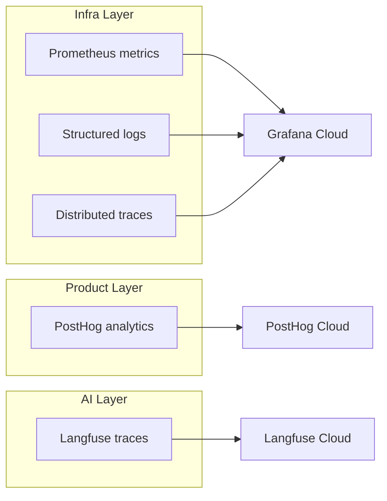

## Overview

UseZombie observability is organized into three layers, each serving a different audience and concern.

## Infrastructure layer — Grafana Cloud

The infrastructure layer covers system health, resource usage, and operational metrics. It is the primary tool for operators monitoring the platform.

- **Prometheus metrics** — Counters, gauges, and histograms for session lifecycle, stage execution, sandbox enforcement, and system resources. Scraped from the `/metrics` endpoint on port 9091.
- **Structured logs** — JSON-formatted logs shipped to Loki. Every log line includes correlation fields for filtering and tracing.
- **Distributed traces** — OpenTelemetry traces shipped to Tempo. Each run generates a trace spanning API request, queue claim, stage execution, and PR creation.

## Product layer — PostHog

The product layer tracks user-facing events and feature adoption. It answers questions like "how many specs were submitted this week" and "what is the P95 time-to-PR."

- Events are emitted from the API server and the CLI.
- No PII is stored — events reference workspace IDs and anonymized user IDs.
- Used for product decisions, funnel analysis, and feature flags.

## AI layer — Langfuse

The AI layer traces agent behavior within each run. It answers questions like "how many tokens did the agent use" and "where did the agent spend the most time."

- Each stage execution generates a Langfuse trace with prompt/completion pairs.
- Token usage, latency, and model selection are recorded.
- Used for cost analysis, prompt optimization, and agent quality scoring.

## Correlation fields

All three layers share a common set of correlation fields that enable cross-layer investigation:

| Field | Description | Present in |
|-------|-------------|------------|
| `trace_id` | OpenTelemetry trace ID | Grafana, Langfuse |
| `run_id` | UseZombie run identifier | All three layers |
| `workspace_id` | Workspace scoping | All three layers |
| `stage_id` | Individual stage within a run | Grafana, Langfuse |
| `executor_id` | Executor instance that handled the stage | Grafana |

To investigate a failed run across all layers:

1. Start with the `run_id` from the API response or CLI output.
2. Search Grafana logs and traces by `run_id`.
3. Search Langfuse traces by `run_id` to see agent behavior.
4. Search PostHog by `run_id` to see the user-facing event timeline.
