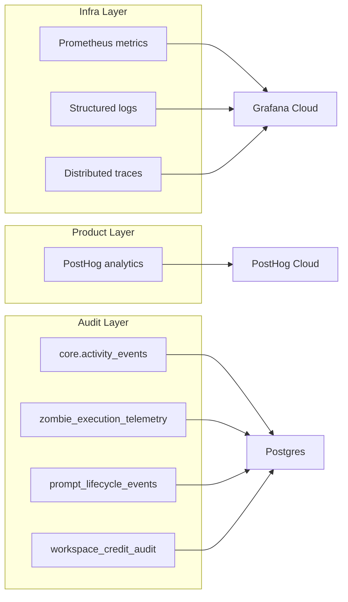

## Overview

UseZombie observability is organized into three layers, each serving a different audience and concern.

## Infrastructure layer — Grafana Cloud

The infrastructure layer covers system health, resource usage, and operational metrics. It is the primary tool for operators monitoring the platform.

- **Prometheus metrics** — Counters, gauges, and histograms for zombie lifecycle, agent execution, sandbox enforcement, and system resources. Scraped from the `/metrics` endpoint.
- **Structured logs** — JSON-formatted logs shipped to Loki. Every log line includes correlation fields for filtering and tracing.
- **Distributed traces** — OpenTelemetry traces shipped to Tempo. Each zombie delivery generates a trace spanning webhook ingestion, queue claim, agent execution, and side-effect dispatch.

## Product layer — PostHog

The product layer tracks user-facing events and feature adoption. It answers questions like "how many zombies were triggered this week" and "what is the P95 time-to-completion."

- Events are emitted from the API server, the worker, and the CLI.
- No PII is stored — events reference workspace IDs and anonymized user IDs.
- Used for product decisions, funnel analysis, and feature flags.

## Audit layer — Postgres

The audit layer is the richest source of per-zombie detail. It is append-only, survives log retention windows, and is queryable with SQL.

- **Activity stream (`core.activity_events`)** — per-zombie and per-workspace event log. Every trigger, agent call, approval gate, and completion lands here with the owning `zombie_id` and `workspace_id`.
- **Execution telemetry (`zombie_execution_telemetry`)** — per-delivery cost and latency audit. One row per completed zombie event with `token_count`, `wall_seconds`, and `time_to_first_token_ms`.
- **Prompt lifecycle events (`prompt_lifecycle_events`)** — append-only agent prompt audit. Records the full prompt/response chain for each agent turn.
- **Credit audit trail (`workspace_credit_audit`, `workspace_billing_audit`)** — billing ledger. Every credit debit, grant, and plan change is recorded with its `event_id`.

## Correlation fields

All layers share a common set of correlation fields that enable cross-layer investigation:

| Field | Description | Present in |
|-------|-------------|------------|
| `trace_id` | OpenTelemetry trace ID | Grafana |
| `event_id` | Webhook event identifier (stable across redelivery) | Grafana, PostHog, Audit |
| `zombie_id` | Zombie instance that handled the event | Grafana, PostHog, Audit |
| `workspace_id` | Workspace scoping | All layers |

To investigate a failed zombie delivery across all layers:

1. Start with the `event_id` from the webhook response or activity stream UI.
2. Search Grafana logs and traces by `event_id` or `zombie_id`.
3. Search PostHog by `workspace_id`, or by `zombie_id` on server-side events (`zombie_triggered` / `zombie_completed`) — note that `zombie_id` is stripped from app-surface events.
4. Query the activity stream (`core.activity_events`) filtered by `zombie_id` for the full per-event audit.
