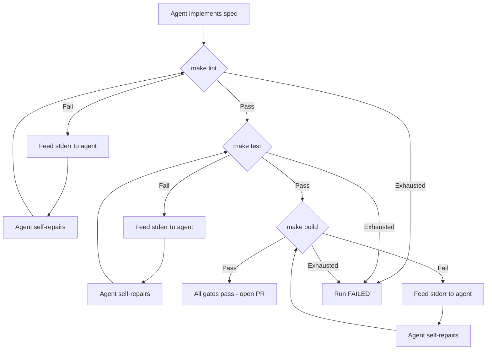

Every run passes through a sequential gate loop that validates the agent's work. If a gate fails, the agent reads the error output, modifies the code, and retries — automatically.

## Three sequential gates

The gate loop runs three gates in strict order. A gate must pass before the next one starts.

| Gate | Make target | Purpose |
| --- | --- | --- |
| Lint | `make lint` | Static analysis, formatting, type checks |
| Test | `make test` | Unit tests |
| Build | `make build` | Production compilation or bundling |

These are your repo's own Make targets. UseZombie does not impose its own linting rules or test framework — it runs whatever your project already uses.

## Self-repair cycle

When a gate fails:

1. The executor captures `stdout` and `stderr` from the failing Make target.
2. The captured output is fed back to the agent as a new conversation turn.
3. The agent reads the error, modifies the code, and the gate is retried.

This happens automatically. No human intervention is needed unless repair loops are exhausted.

## Repair loop limits

Each gate has a configurable maximum number of repair attempts. The default is **3 loops per gate**.

| Scenario | Behavior |
| --- | --- |
| Gate passes on first attempt | Move to next gate |
| Gate fails, agent repairs, retry passes | Move to next gate |
| Gate fails 3 times | Run marked `FAILED` |

You can override the default per agent profile. Higher limits give the agent more chances but consume more tokens.

## Gate exhaustion

If all repair loops for any gate are exhausted, the run is marked `FAILED` with a structured gate failure record containing:

- Which gate failed (`lint`, `test`, or `build`)
- The number of repair attempts made
- The final `stderr`/`stdout` capture from the last attempt

Use `zombiectl run status <id>` to inspect the failure details.

## How gates are executed

Gate tools are **NullClaw tool definitions** passed to the agent via executor RPC. The executor is agent-agnostic — it does not know or care which LLM is behind the agent. It sends a tool call, gets a result, and feeds it back.

This means gate execution works identically regardless of the underlying model.

## Loop recording

Each loop iteration is recorded with:

- **Gate name** — which gate was running
- **Outcome** — `PASS` or `FAIL`
- **Captured output** — the full `stdout`/`stderr` from the Make target

These records are available for replay and debugging. They form the backbone of the run's audit trail.
