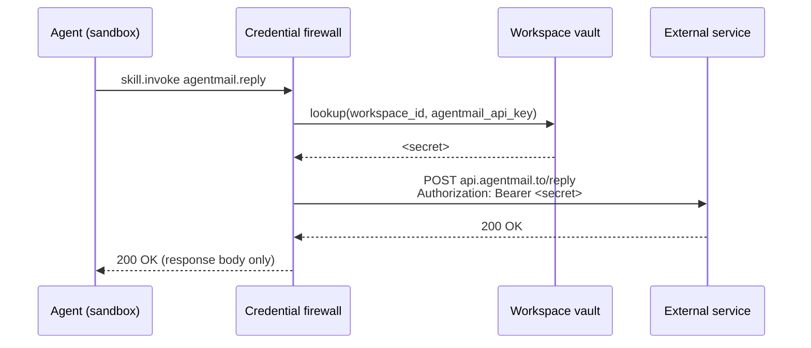

## Overview

Every zombie you deploy eventually needs to call an external service: Slack, GitHub, AgentMail, OpenAI. Those services want an API key. You do **not** want your agent — running untrusted model-generated reasoning inside a sandbox — to ever hold that key in memory.

The **workspace vault** is the answer. Secrets live in a dedicated, encrypted vault scoped to the workspace. Each secret is addressed by a bare key name (for example, `agentmail_api_key`). Your zombie's `TRIGGER.md` declares which key names it needs; at event time the credential firewall fetches the value, makes the outbound call, and returns only the response. The raw value never crosses the sandbox boundary.



## Adding a credential

`zombiectl credential add <name> --data=<json>` stores a JSON-shaped secret in the current workspace's vault. The name is what you reference from `TRIGGER.md`.

Pipe the JSON on stdin so secrets never appear in shell history or process argv:

```bash
zombiectl credential add github --data @- <<'JSON'
{
  "api_token": "ghp_...",
  "webhook_secret": "<32-byte hex>"
}
JSON
```

```
✓ Credential 'github' stored in vault.
```

The command POSTs to `/v1/workspaces/{workspace_id}/credentials` with the JSON body. Values are encrypted at rest; only the credential firewall can decrypt them when servicing an outbound call.

The default behaviour is **skip-if-exists** — passing the same name twice is a no-op. Use `--force` to overwrite an existing credential (rotation).

Exit codes:

- `0` — stored (or skip-if-exists).
- `1` — no workspace selected, or API error.
- `2` — missing `<name>`, missing `--data`, or invalid JSON.

## Listing credentials

`zombiectl credential list` returns the names and creation timestamps of every credential in the current workspace. **Values are never returned.** This is by design — once stored, a secret is only ever used by the firewall.

```bash
zombiectl credential list
```

```
  agentmail_api_key  2026-04-15T10:22:31Z
  github_token       2026-04-16T14:55:12Z
  slack_bot_token    2026-04-17T09:03:44Z
```

Pass `--json` for machine-readable output.

## Referencing credentials from `TRIGGER.md`

A zombie declares the credentials it needs as a **list of bare key names** in its `TRIGGER.md` frontmatter. Nothing else — no URI scheme, no path, no secret-manager-specific prefix. The names are looked up verbatim against the workspace vault.

```yaml
---
name: platform-ops-zombie

x-usezombie:
  trigger:
    type: webhook
    source: github
    signature:
      secret_ref: github_secret
      header: x-hub-signature-256
      prefix: "sha256="

  credentials:
    - github
    - slack
---
```

At event delivery time the credential firewall fetches each named secret from the vault and substitutes it into the outbound HTTP call. The agent never sees the resolved value.

If a zombie references a credential that is not present in the vault when `zombiectl install --from <path>` is called, install fails with a clear error listing the missing names.

## Rotation

Rotating a credential is a single command — no re-install is needed. The next event handled by any zombie using that credential picks up the new value.

```bash
zombiectl credential add github --data @- --force <<'JSON'
{ "api_token": "ghp_...new...", "webhook_secret": "<new>" }
JSON
```

`--force` is required to overwrite an existing credential — without it, the default skip-if-exists behaviour leaves the old value in place.

## Deletion

```bash
zombiectl credential delete <name>
```

`zombiectl credential show <name>` prints metadata (creation timestamp, last-rotated) but **never the value**. The vault is one-way: write at the boundary, read only by the firewall.

## What the agent can and cannot see

| Thing | Can the agent see it? |
|-------|----------------------|
| The credential's **name** (`agentmail_api_key`) | Yes. It is needed to call the right skill. |
| The credential's **value** (the raw secret) | No. The firewall injects and strips it outside the sandbox. |
| The **response body** from the external service | Yes. The agent needs the data to reason about what to do next. |
| Any **headers** the external service set | Yes, unless they carry sensitive tokens — the firewall redacts known-sensitive header names. |

This is the core security guarantee. If the agent is compromised — model-prompt injection, jailbreak, whatever — your keys are not. The agent never had them.
