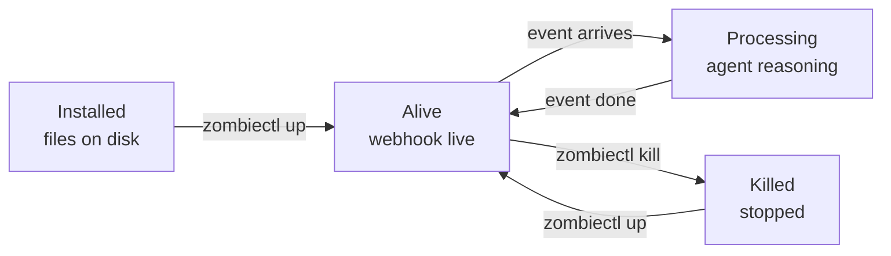

## Overview

A **zombie** is a preconfigured, always-on agent process in your workspace. You describe it once — its trigger, the skills it can use, the credentials it needs, the budget it is allowed to consume — and the platform keeps it alive, receiving events and invoking the agent, until you kill it.

Everything in this section of the docs is about working with zombies: how to install one from a template, how to start and stop it, how to attach credentials, how webhooks reach it, and how to author the `SKILL.md` and `TRIGGER.md` files that define its behavior.

## Lifecycle

A zombie moves through four observable states. Each state has a single CLI command that moves it to the next.



1. **Installed.** `zombiectl install <template>` writes a directory to disk containing a `SKILL.md` (agent instructions) and a `TRIGGER.md` (machine-readable config). No API calls yet — the zombie is local-only.
2. **Alive.** `zombiectl up` uploads the two files to your workspace, provisions a unique webhook URL, and starts the event loop. The zombie is now reachable from the internet and waiting.
3. **Processing.** When an authenticated event arrives on the webhook, the event loop claims it, feeds it to the sandboxed agent, and the agent reasons, invokes skills, and produces a response. Each event is processed in order; session state is checkpointed after every event.
4. **Killed.** `zombiectl kill <name>` terminates the event loop and marks the webhook inactive. Session state is preserved so the same name can be brought back up cleanly.

You can inspect state at any time with `zombiectl status` (all zombies in the current workspace) and `zombiectl logs --zombie <id>` (the activity stream for one zombie).

```bash
zombiectl status
zombiectl logs --zombie zm_01JABC...
```

## Workspace scoping

Every zombie belongs to exactly one **workspace**. The workspace is the boundary for:

- **Credentials** — the vault that zombies read from when they invoke skills. See [Credentials](/zombies/credentials).
- **Access control** — teammates invited to a workspace can see, start, and kill its zombies; they cannot see zombies in other workspaces.
- **Webhook namespace** — every zombie in a workspace gets its own unique URL under `https://hooks.usezombie.com/v1/webhooks/{zombie_id}`.

Billing is **not** workspace-scoped. Every zombie run — no matter which workspace it lives in — debits the same tenant wallet. See [Key concepts](/concepts#credits) for the single-wallet model.

The current workspace is set automatically by `zombiectl workspace add` or can be switched via `zombiectl workspace list` and the Mission Control dashboard.

## What's next

<CardGroup cols={2}>
  <Card title="Install a zombie" icon="download" href="/zombies/install">
    Scaffold a zombie from a bundled template.
  </Card>
  <Card title="Start, stop, observe" icon="circle-play" href="/zombies/running">
    The `up`, `status`, `kill`, and `logs` commands.
  </Card>
  <Card title="Workspace credentials" icon="key" href="/zombies/credentials">
    Add secrets to the vault without the agent ever seeing them.
  </Card>
  <Card title="Skill authoring" icon="file-code" href="/zombies/skills">
    How `SKILL.md` and `TRIGGER.md` combine to define a zombie.
  </Card>
</CardGroup>
