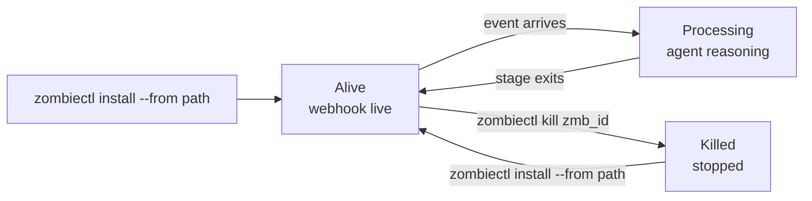

## Overview

A **zombie** is a preconfigured, always-on agent process in your workspace. You describe it once — its trigger, the skills it can use, the credentials it needs, the budget it is allowed to consume — and the platform keeps it alive, receiving events and invoking the agent, until you kill it.

Everything in this section of the docs is about working with zombies: how to install one from a template, how to start and stop it, how to attach credentials, how webhooks reach it, and how to author the `SKILL.md` and `TRIGGER.md` files that define its behavior.

## Lifecycle

A zombie moves through three observable states.



1. **Alive.** `zombiectl install --from <path>` reads the local `SKILL.md` + `TRIGGER.md`, validates the schema, uploads to your workspace, provisions the webhook URL, and starts the event loop. Install is the deploy — there is no separate `up` step.
2. **Processing.** When a signed event arrives (webhook, cron, or steer), the platform opens a **stage**: the agent reads the event, reasons, invokes the tools listed in `TRIGGER.md`, and produces a result. The activity stream is the durable record — replay any time with `zombiectl events <zombie_id>`.
3. **Killed.** `zombiectl kill <zombie_id>` stops the in-flight stage and marks the zombie as killed. State is checkpointed; nothing on the event stream is lost. Re-install with the same name to bring it back.

You can inspect state at any time:

```bash
zombiectl status                     # every zombie in the active workspace
zombiectl events zmb_2041 --follow   # tail the live activity stream for one zombie
zombiectl steer zmb_2041 "morning health check"   # manual trigger
```

## Workspace scoping

Every zombie belongs to exactly one **workspace**. The workspace is the boundary for:

- **Credentials** — the vault that zombies read from when they invoke skills. See [Credentials](/zombies/credentials).
- **Access control** — teammates invited to a workspace can see, start, and kill its zombies; they cannot see zombies in other workspaces.
- **Webhook namespace** — every zombie in a workspace gets its own unique URL under `https://api.usezombie.com/v1/webhooks/{zombie_id}`.

Billing is **not** workspace-scoped. Every stage — no matter which workspace it lives in — debits the same tenant wallet. See [Key concepts](/concepts#credits) for the single-wallet model.

The current workspace is set automatically by `zombiectl workspace add` or can be switched via `zombiectl workspace list` and the Mission Control dashboard.

## What's next

<CardGroup cols={2}>
  <Card title="Install a zombie" icon="download" href="/zombies/install">
    Scaffold a zombie from a bundled template.
  </Card>
  <Card title="Start, stop, observe" icon="circle-play" href="/zombies/running">
    The `install`, `status`, `events`, `steer`, and `kill` commands.
  </Card>
  <Card title="Workspace credentials" icon="key" href="/zombies/credentials">
    Add secrets to the vault without the agent ever seeing them.
  </Card>
  <Card title="Authoring a zombie" icon="file-code" href="/zombies/authoring">
    How `SKILL.md` and `TRIGGER.md` combine to define a zombie.
  </Card>
</CardGroup>
